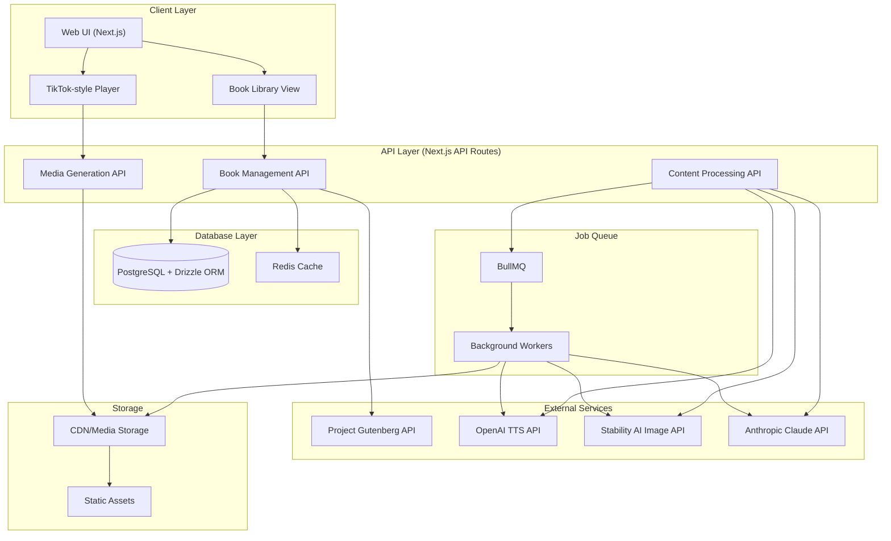

```mermaid
    erDiagram
    Books ||--o{ Sequences : contains
    Books ||--o{ Characters : has
    Books ||--o{ UserBookProgress : tracked_by
    Users ||--o{ UserBookProgress : tracks
    Users ||--o{ UserBookmarks : creates
    Books ||--o{ UserBookmarks : has
    Sequences ||--o{ SequenceCharacters : includes
    Characters ||--o{ SequenceCharacters : appears_in
    Sequences ||--|| SequenceMedia : has
    Sequences ||--|| SequenceMetadata : has
    Sequences ||--o{ UserSequenceHistory : tracked_by
    Users ||--o{ UserSequenceHistory : tracks
    Users ||--o{ Accounts : has
    Users ||--o{ Sessions : has

    Books {
        uuid id PK
        string gutenbergId UK
        string title
        string author
        string coverImageUrl
        string status
        jsonb metadata
        timestamp createdAt
        timestamp updatedAt
    }

    Users {
        uuid id PK
        string email UK
        string name
        timestamp emailVerified
        string image
        timestamp createdAt
    }

    UserBookProgress {
        uuid id PK
        uuid userId FK
        uuid bookId FK
        integer lastSequenceNumber
        timestamp lastReadAt
        integer totalTimeSpent
        boolean isComplete
        jsonb readingPreferences
        timestamp updatedAt
    }

    UserBookmarks {
        uuid id PK
        uuid userId FK
        uuid bookId FK
        integer sequenceNumber
        string note
        timestamp createdAt
    }

    UserSequenceHistory {
        uuid id PK
        uuid userId FK
        uuid sequenceId FK
        timestamp viewedAt
        integer timeSpent
        boolean completed
        jsonb preferences
    }

    Characters {
        uuid id PK
        uuid bookId FK
        string name
        text description
        jsonb attributes
        timestamp firstAppearance
        timestamp createdAt
    }

    Sequences {
        uuid id PK
        uuid bookId FK
        integer sequenceNumber
        text content
        integer startPosition
        integer endPosition
        string status
        timestamp createdAt
    }

    SequenceCharacters {
        uuid id PK
        uuid sequenceId FK
        uuid characterId FK
        string role
        jsonb context
    }

    SequenceMedia {
        uuid id PK
        uuid sequenceId FK UK
        string audioUrl
        string imageUrl
        integer audioDuration
        jsonb imageMetadata
        timestamp generatedAt
    }

    SequenceMetadata {
        uuid id PK
        uuid sequenceId FK UK
        jsonb sceneDescription
        jsonb cameraDirections
        jsonb mood
        jsonb lighting
        jsonb settings
        jsonb aiAnnotations
    }

    Accounts {
        uuid id PK
        uuid userId FK
        string type
        string provider
        string providerAccountId
        string refreshToken
        string accessToken
        integer expiresAt
        string tokenType
        string scope
        string idToken
        string sessionState
    }

    Sessions {
        uuid id PK
        string sessionToken UK
        uuid userId FK
        timestamp expires
    }
```
