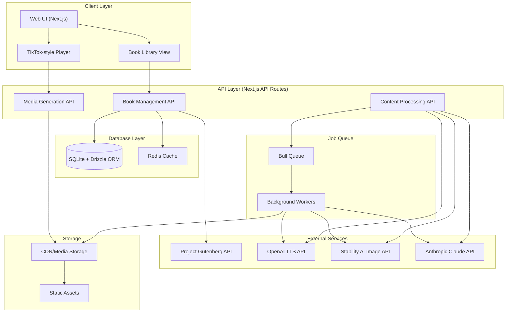

```mermaid
erDiagram
    erDiagram
    Books ||--o{ Sequences : contains
    Books ||--o{ Characters : has
    Books ||--o{ UserBookProgress : tracked_by
    Users ||--o{ UserBookProgress : tracks
    Users ||--o{ UserBookmarks : creates
    Books ||--o{ UserBookmarks : has
    Sequences ||--o{ SequenceCharacters : includes
    Characters ||--o{ SequenceCharacters : appears_in
    Sequences ||--|| SequenceMedia : has
    Sequences ||--|| SequenceMetadata : has
    Sequences ||--o{ UserSequenceHistory : tracked_by
    Users ||--o{ UserSequenceHistory : tracks

    Books {
        string id PK
        string gutenbergId UK
        string title
        string author
        string coverImageUrl
        string status
        json metadata
        timestamp createdAt
        timestamp updatedAt
    }

    Users {
        string id PK
        string email UK
        string name
        timestamp createdAt
    }

    UserBookProgress {
        string id PK
        string userId FK
        string bookId FK
        integer lastSequenceNumber
        timestamp lastReadAt
        integer totalTimeSpent
        boolean isComplete
        json readingPreferences
        timestamp updatedAt
    }

    UserBookmarks {
        string id PK
        string userId FK
        string bookId FK
        integer sequenceNumber
        string note
        timestamp createdAt
    }

    UserSequenceHistory {
        string id PK
        string userId FK
        string sequenceId FK
        timestamp viewedAt
        integer timeSpent
        boolean completed
        json preferences
    }

    Characters {
        string id PK
        string bookId FK
        string name
        text description
        json attributes
        timestamp firstAppearance
        timestamp createdAt
    }

    Sequences {
        string id PK
        string bookId FK
        integer sequenceNumber
        text content
        integer startPosition
        integer endPosition
        string status
        timestamp createdAt
    }

    SequenceCharacters {
        string id PK
        string sequenceId FK
        string characterId FK
        string role
        json context
    }

    SequenceMedia {
        string id PK
        string sequenceId FK
        string audioUrl
        string imageUrl
        integer audioDuration
        json imageMetadata
        timestamp generatedAt
    }

    SequenceMetadata {
        string id PK
        string sequenceId FK
        json sceneDescription
        json cameraDirections
        json mood
        json lighting
        json settings
        json aiAnnotations
    }
```
